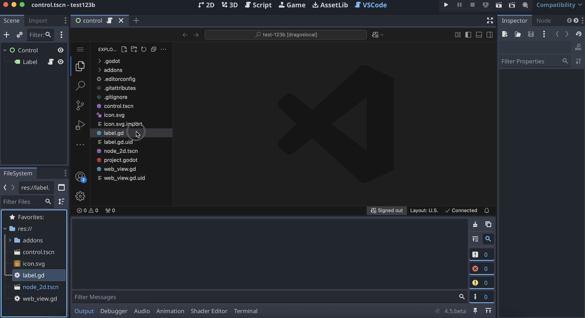

# Godot VSCode IDE



This repo embeds VSCode editor to the Godot Engine as a module (for now).

## How it works?

It creates a Webview node and loads the website `https://vscode.dev`. Then, it creates a tunnel from your local vscode by running `code tunnel` (automatically) and connects to that.

## Dependencies

- [appsinacup/godot_wry](https://github.com/appsinacup/godot_wry): Fork of godot_wry (Webview component) that fixes some sizing issue.
- [appsinacup/gdterm](https://github.com/appsinacup/gdterm): Fork of gdterm (terminal) that adds more tabs and a singleton for running commands and creating tabs.

## How to install

Build locally godot as you would after cloning this to the modules folder.

```sh
scons
```
